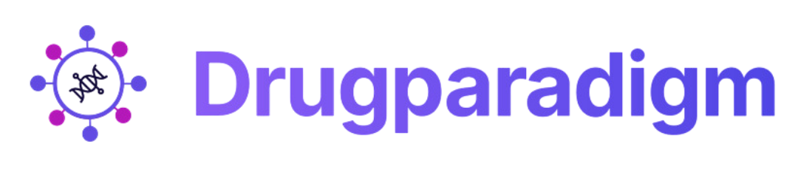

  

### Generative AI for Next-Generation Therapeutics

DrugParadigm is a generative AI–powered startup accelerating drug discovery through a unified, ready-to-use AI platform.  
Founded in **January 2025**, we bring together an interdisciplinary team of **30 researchers and engineers across 4 campuses** (KMIT,NGIT,KMEC,KMCE), focused on solving complex drug discovery problems using deep learning and generative models.

---

## 🧬 What We Do

We are building a **versatile AI ecosystem** that democratizes drug discovery via:
- ☁️ **Cloud-based platform**
- 🔌 **Direct API integration**
- 🖥 **Dedicated GPU infrastructure**

Our models capture complex relationships between **structure, sequence, and biochemical properties**, enabling state-of-the-art predictive and generative performance across multiple drug modalities.

---

## 🧬 Focus

We build **state-of-the-art predictive and generative models** that capture complex relationships between **molecular structure, biological sequence, and biochemical properties**, enabling faster and more reliable therapeutic design.

Our research spans next-generation drug modalities including:
- Antibody–Drug Conjugates (ADCs)
- PROTACs
- Molecular Glues
- Macrocycles
- Peptide Therapeutics
- Binding Affinity Prediction (protein–protein, peptide–MHC)

---

## 🚀 Why It Matters

- Models outperform benchmarks published in **Nature, Oxford**, and leading academic labs
- Designed for **real-world drug discovery**, not toy datasets
- Bridging research-grade AI with deployable platforms

All models are accessible via **drugparadigm.com**.  
Associated research papers are currently **under peer review**.

---

## 🤝 Collaboration

We are open to:
- Co-developing custom AI models
- Research collaborations
- Providing access to our AI frameworks & compute infrastructure

---

## 📫 Contact

🌐 Website: https://drugparadigm.com  
📧 Email: outreach@drugparadigm.in  
📍 Location: Uppal, India  

---
